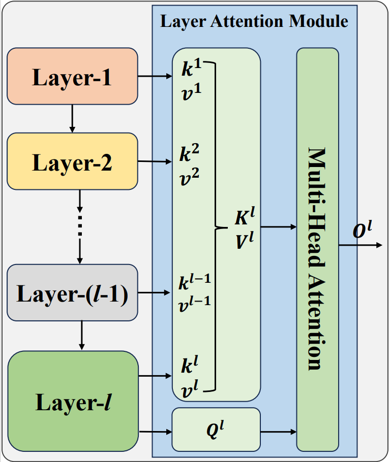
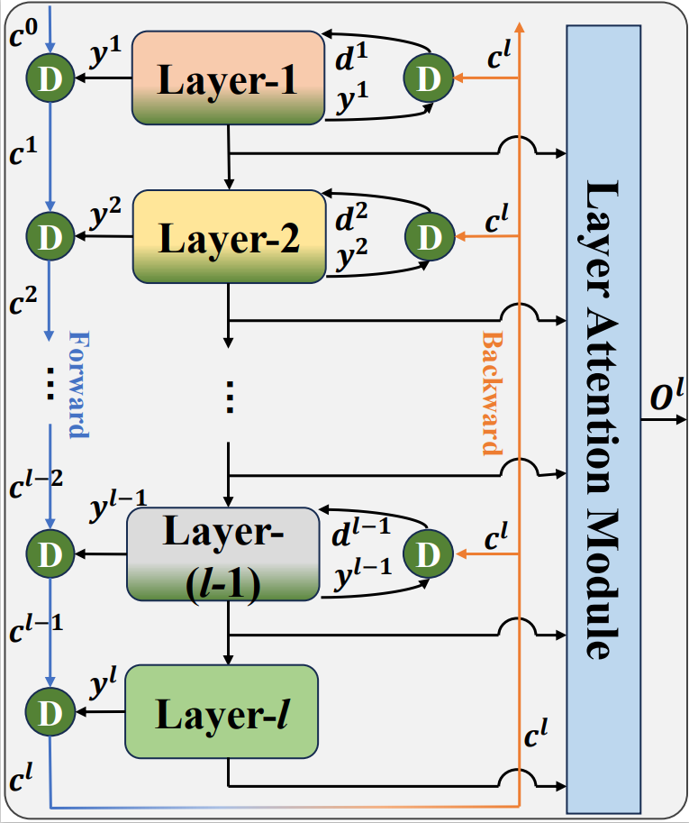

# DLA-Net

We delve into the distinction between layer attention and the general attention mechanism, noting that existing layer attention methods achieve layer interaction on fixed feature maps in a static manner. To restore the dynamic context representation capability of the attention mechanism, we propose a Dynamic Layer Attention (DLA) architecture.

SLA (Static Layer Attention Architecture):

<div style="text-align: center;">
  
</div>


DLA (Dynamic Layer Attention Architecture

<br/>


## News
Our paper has been accepted by IJCAI 2024. 

Here is the arXiv link: https://arxiv.org/abs/2406.13392

Google Scholar is coming soon.

##  Installation

### Requirements


- Python 3.7+
- PyTorch 1.7+
- MMDetection


### Our environments
- OS: Ubuntu 22.04
- Python: 3.8
- CUDA: 12.2
- Toolkit: Pytorch 1.13
- mmdet: 3.2.0 

## Usage

### Train with ResNet on CIFAR-10/CIFAR-100

You can run the ```run.sh``` to train or train as following command:

``` bash
 python cifar.py -a dla_b --train-batch 128 --dataset cifar100 --depth 110 --block-name bottleneck --lr 0.1 --epochs 180 --schedule 100 150 --drop-path 0.2   --gamma 0.1 --wd 1e-4 --checkpoint checkpoints/cifar100/resnet-110/dla-l-110
```

### Train with ResNet on ImageNet-1k
You can run the ```run.sh``` to train or train as following command:

```bash
python train.py '~/workspace/imagenet' -a resnet50_dla_l -b 256 --epochs 100 --warmup-epochs 3  --world-size 1 --rank 0 --workers 10
```

### Train with Faster R-CNN and Mask R-CNN on COCO2017
Put the files into the same folder as in this repository, e.g., put 'resnet_dlal.py' in './mmdetection/mmdet/models/backbones/', and import the model in the init.py file.

Then, you could train a faster_rcnn with our DLA on ResNet-50 using 2 GPUs (batch=16, samples_per_gpu=8),

```bash
CUDA_VISIBLE_DEVICES=0,1 python tools/train.py configs/faster_rcnn/faster_rcnn_r50dlal_fpn_1x_coco.py --cfg-options data.samples_per_gpu=8
```
